# Sesión II - Gestión avanzada y descarga de datos
Herramientas computacionales para bioinformática: UNIX, expresiones regulares y shell script

Edita esta plantilla en formato markdown [Guía aquí](https://guides.github.com/features/mastering-markdown/) como se pide en el guión. 
Cuando hayas acabado, haz un commit de tus cambios y súbelos al repositorio antes de la fecha de entrega señalada. 
Puedes usar el cliente 

======================================
Antes de comenzar, crea

## Ejercicio 1
Crea una copia de la carpeta gtfs. Luego crea enlaces duros y blandos a los ficheros .gtf y responde:

1. ¿Qué ocurre cuando se borra el origen y se intenta acceder al destino?
2. ¿Qué ocurre cuando se borra el destino y se intenta acceder al origen?
3. ¿Qué ocurre con la otra parte cuando se edita el destino o el origen del enlace?
4. ¿Qué ocurre cuando copiamos un enlace?

### Respuesta ejercicio 1

Hemos copiado la carpeta gtfs a otra que se llama gtfs2 después, hemos realizado una copia del archivo `Drosophila_melanogaster.BDGP6.28.102.gtf` y hemos llamado a la copia `Drosophila_melanogaster.BDGP6.28.102-copy.gtf` para ello hemos empleado el comando `cp 2-gestion-y-descarga-pedro-antonio/gtfs/Drosophila_melanogaster.BDGP6.28.102-copy.gtf 2-gestion-y-descarga-pedro-antonio/gtfs2`. Después hemos creado un enlace duro y uno blando al archivo `Drosophila_melanogaster.BDGP6.28.102-copy.gtf`, para crear el enlace duro se ha empleado el comando `ln /home/pedrojf/2-gestion-y-descarga-pedro-antonio/gtfs2/Drosophila_melanogaster.BDGP6.28.102-copy.gtf prueba-1`, mientras que para el blando el comando `ln -s /home/pedrojf/2-gestion-y-descarga-pedro-antonio/gtfs2/Drosophila_melanogaster.BDGP6.28.102-copy.gtf prueba-2`. Al enlace duro lo hemos denominado prueba-1 y al blando prueba-2. 

COMENTARIO MIRIAM Y SANDRA no se han creado los archivos .txt (2.5)

1. ¿Qué ocurre cuando se borra el origen y se intenta acceder al destino?

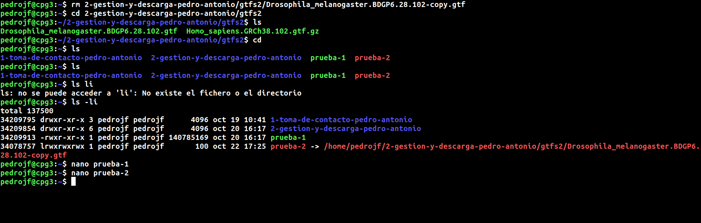

Comandos introducidos:

`rm 2-gestion-y-descarga-pedro-antonio/gtfs2/Drosophila_melanogaster.BDGP6.28.102-copy.gtf`

Cuando se borra el origen (es decir el archivo original al cúal van enlazados los enlaces), de un enlace duro, se puede seguir accediendo al archivo original.

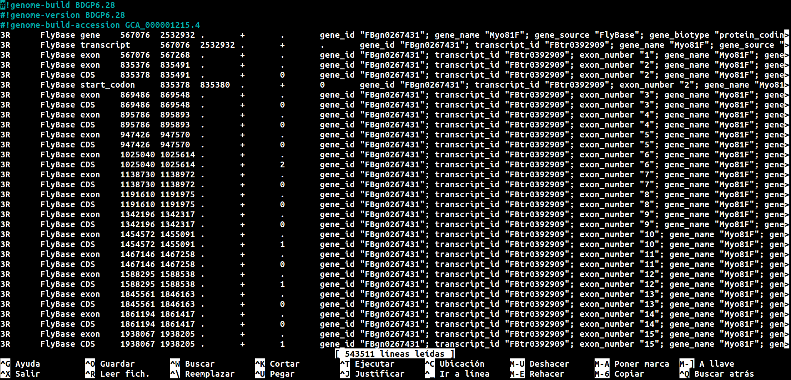

Sin embargo con los enlaces blandos al intentar abrir el archivo con el comando nano para editarlo, este aparece en blanco, lo que quiere decir que no se puede acceder al archivo original.

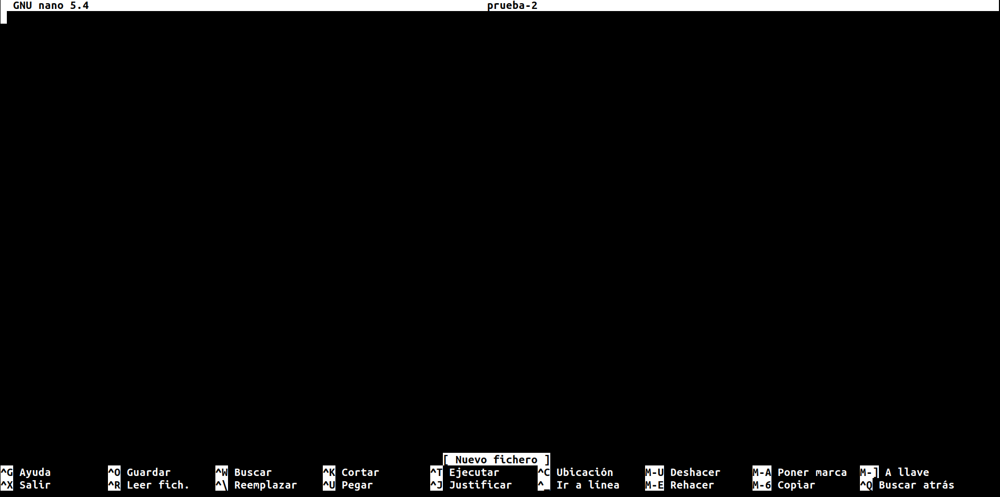

2. ¿Qué ocurre cuando se borra el destino y se intenta acceder al origen?

Cuando se borra el destino (entendiendo por destino el enlace), de un enlace duro, es decir, se borra el enlace duro, este deja de existir y por lo tanto ya no se puede emplear, sin embargo el archivo orginal al cual estaba enlazado (el origen) permanece intacto.

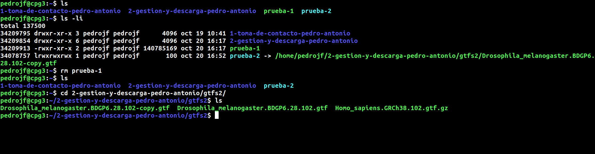

Comandos introducidos:

`rm prueba-1`

Cuando se borra el destino (entendiendo por destino el enlace), de un enlace blando, es decir, se borra el enlace blando, este deja de existir y por lo tanto ya no se puede emplear, sin embargo el archivo orginal al cual estaba enlazado (el origen) permanece intacto.

Comandos introducidos:

`rm prueba-2`

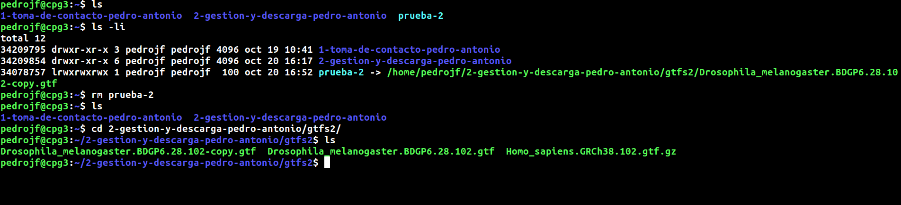

3. ¿Qué ocurre con la otra parte cuando se edita el destino o el origen del enlace?

En el enlace duro cuando se edita con el comando `nano` el destino (enlace) los cambios no aparecen en el orígen (archivo original), y si se edita el origen los cambios tampoco aparecen en el destino (enlace).

Sin embargo en el enlace blando si que aparece la edición que hemos realizado en el origen (archivo original). Además si se edita el enlace, los cambios también aparecen en el orígen (archivo original).

4. ¿Qué ocurre cuando copiamos un enlace?

Comandos introducidos:

`cp prueba-1 prueba-1-copy`\
`cp prueba-2 prueba-2-copy`

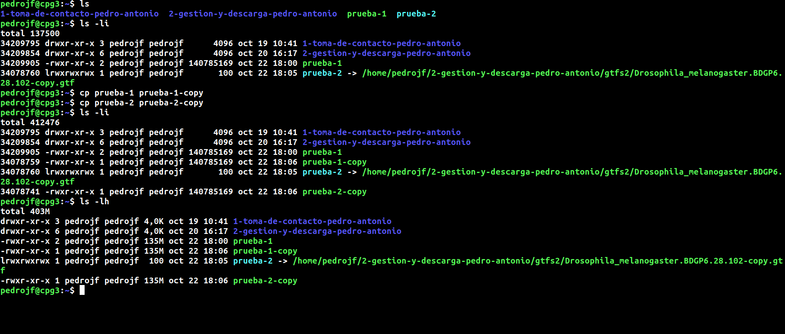

Tal y como se aprecia en la imágen, al copiar el enlace duro se ha generado otro enlace duro que apunta a un inodo diferente, mientras que al copiar el enlace blando se ha creado un enlace duro que apunta de nuevo a un inodo distinto al de los otros enlaces.

El ejercicio en conjunto se ha resuelto bastante bien, excepto la creacion de archivos .txt, pero la creacion de los enlaces asi como las respuestas a la eliminación de y copia de enlaces se ha resuelto de manera eficaz.

## Ejercicio 2
Usa la documentación de find para encontrar las opciones que permiten encontrar todos los notebook Jupyter (ficheros con extension ipynb) con fecha de última modificación 17 de Noviembre de 2020 que haya en el directorio /home/alejandro. Excluye todos aquellos que se encuentren dentro de directorios ocultos (aquellos que comienzan por un punto ).

### Respuesta ejercicio 2
Para encontrar los notebook Jupyter (ficheros con extensión .ipynb) en el directorio /home/alejandro primero de todo nos metemos en el directorio y miramos los ficheros que contiene este (también los ocultos) con el comando: `ls -a`
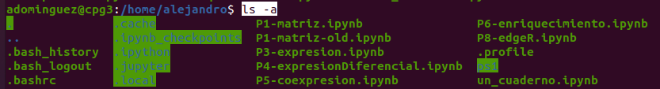

Tras esto procedemos a buscar solo los notebook Jupiter (con extensión .ipynb) que no se encuentren dentro de directorios ocultos (que empiecen por .). Para ello empleamos el comando: 
`find /home/alejandro/[!.]*.ipynb`

cOMENTARIO MYRIAM Y SANDRA: ESTA BIEN A MEDIAS PORQUE EN REALIZAD NO ESTAIS USANDO FIND, QUE ERA LO QUE SE PEDIA EN EL EJERCICIO.(1)

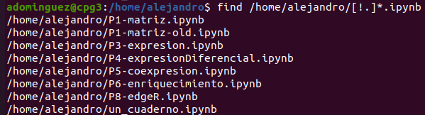

Por último para buscar fecha de última modificación, empleamos el comando `man find` y encontramos que para la fecha de última modificación emplearemos el comando: 
`find -mtime (días desde la última modificación)`

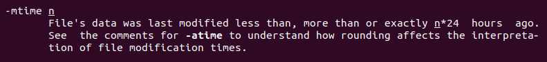

Ahora procedemos a usar este comando junto al otro del nombre sabiendo que los días que han pasado son 344 como se muestra en la foto:

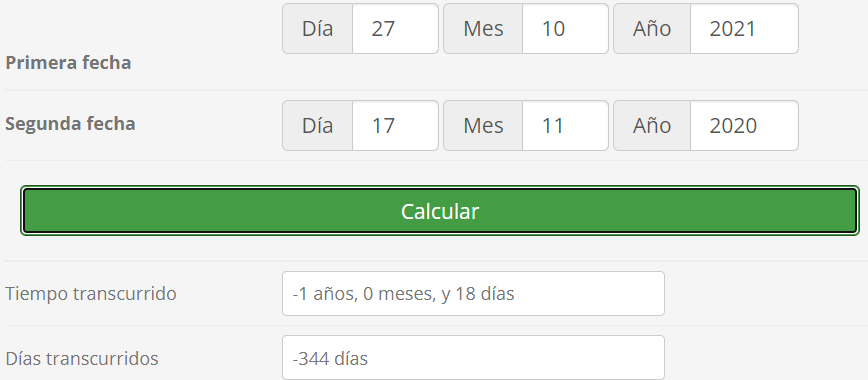

El comando empleado es:
`find /home/alejandro/[!.]*.ipynb -mtime 344`

Y para comprobar que hemos encontrado el fichero correcto empleamos el comando:
`ls -l /home/alejandro/un_cuaderno.ipynb`
Que nos permite ver la fecha de última modificación del documento (17 de noviembre de 2020). 

La resolucion es correcta aunque el comando utilizado no sea el mas apropiado ya que con mtime tienes que calcular manualmente la diferncias de dias en el tiempo.
ellos no han llegado la especificas las condicioens posibles atraves de la Logica buleana pero que a fecha de hoy no tenemos porque saber.

## Ejercicio 3
Descarga, empleando la orden oportuna, todos los ficheros [de esta URL](ftp://ftp.ensembl.org/pub/release-102/gtf/accipiter_nisus/). 
- Inspecciona el fichero CHECKSUMS y genera los checksums adecuados para asegurarte de que los datos son íntegros. 
- Genera un fichero SHA-1 para todos los ficheros .gz descargados y documenta en esta memoria el comando con el que te descargaste los datos, adjuntando aquí los checksums. 

### Respuesta ejercicio 3

Para descargar los datos aplicamos el comando:
`wget --no-directories --recursive --no-parent ftp://ftp.ensembl.org/pub/release-102/gtf/accipiter_nisus/`.

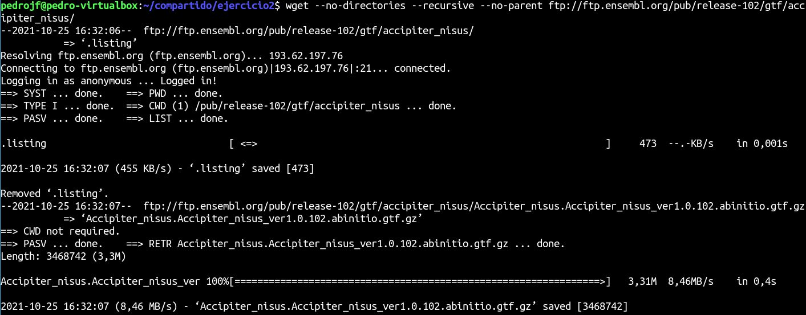

Tras finalizar la descarga la terminal indica que se han descargado 4 archivos que pesan 12M en un tiempo de 1,0s tal y como se muestra en la siguiente imágen:

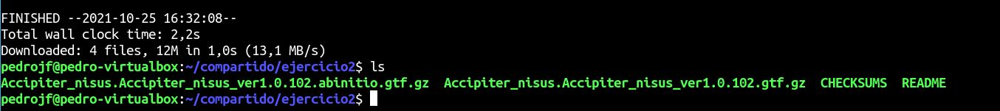

Tras la descarga hay 4 archivos en el directorio, 2 con extensión gtf.gz, uno denominado README y uno que se llama CHEKSUMS que contiene los cheksums generados según el algoritmo CRC.

Tras generar en nuestra máquina los cheksums empleando el algoritmo CRC mediante el comando `sum ./[!C]*` ([!C] sirve para excluir los ficheros que emppiezan por C, en este caso CHEKSUMS ya que no pide que comparemos este en el ejercicio) se han obtenido los siguientes resultados:

Documento CHEKSUMS:

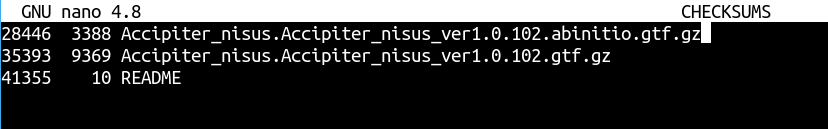

CRC generados:

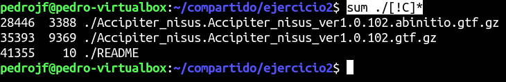

Tal y como se aprecia en las dos imágenes anteriores los cheksums son idénticos, lo cuál quiere decir que se mantiene la integridad de los archivos tras su descarga.

Finalmente generamos un fichero SHA-1 con los cheksums para los dos ficheros .gz, a este fichero lo hemos denominado gtf.gz-cheksums.sha y lo hemos creado mediante el comando `shasum ./*.gtf.gz > gtf.gz-cheksums.sha`.

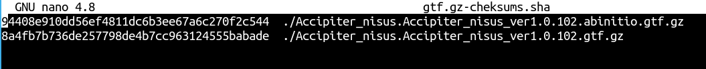

Fichero SHA-1: [gtf.gz-cheksums.sha](documents/gtf.gz-cheksums.sha)

cOEMNTARIO DE SANDRA Y MIRIAM EL EJERCICIO ESTA RESUELTO CORRECTAMENTE.(3.3)
